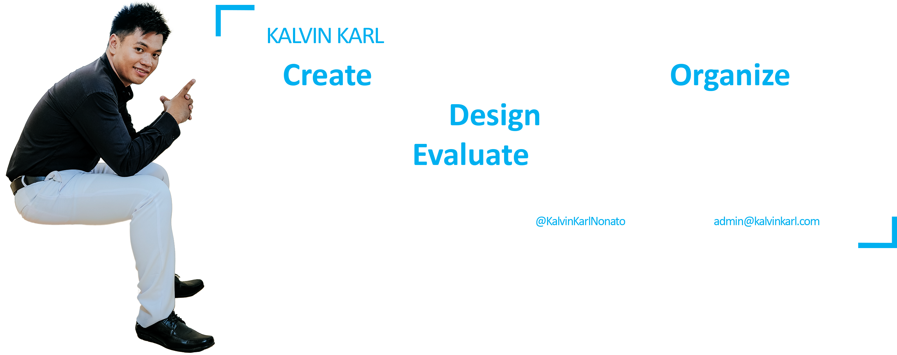

TRY TO ME ON <a target="_blank" href="https://github.com/settings/appearance">DARKMODE</a>

<h2 align="center">  Hello! I'm Kalvin Karl.</h2>

	
	
	

-------
- 🔭 Currently building [Employee Information System]() | [Examination Management System](https://github.com/kalvinkarlnonato/examination-management-system) | [Campus Billing System](https://github.com/kalvinkarlnonato/campus-billing-system)
- 📉 Teaching **App Development** | **Introduction to computer** | **Java OOP**
- 👨‍💻 Learning **NestJS**
- 🤝 Looking to collaborate on **Desktop development and Web Development**
- 💬 Ask me about **Web Developer MEAN stack | C# .Net Core**
- 📫 How to reach me **kalvinkarl28@gmail.com** | SMART **+639984283333**
- 🧘‍♂️ Learn continuesly **Never stop learning**
- ⚡ Fun fact: **I :heart: :dog:s | :camera:s | :video_game:s** (GamerTag: [YOLO Gamer](https://steamcommunity.com/id/kalvinkarlnonato/))
-------
### Spotify playing 🎧

-------
### languages and tools:

	
		
	
    
		
	
    
		
	
	
		
	
	
		
	
	
		
	
	
		
	
	
		
	
	
		
    
    
		
	
    
		
	
	
		
	
	
		
	
	
		
	
	
		
	
	
		
	
    
		
	
	
		
	
  
		
	
  
		
	
  
		
	
	
		
	
	
		
	
	
		
	

-------

<!---

-->
